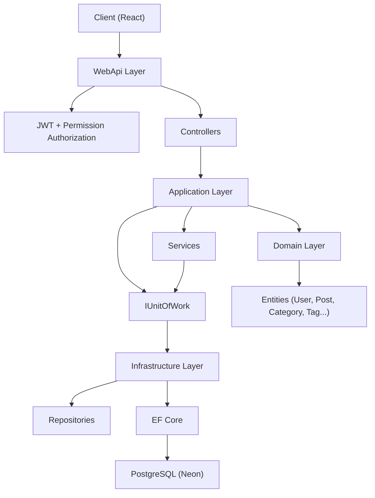
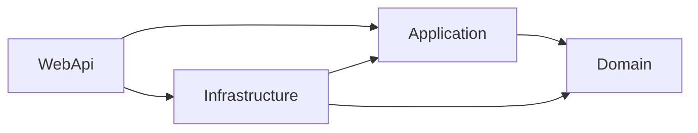
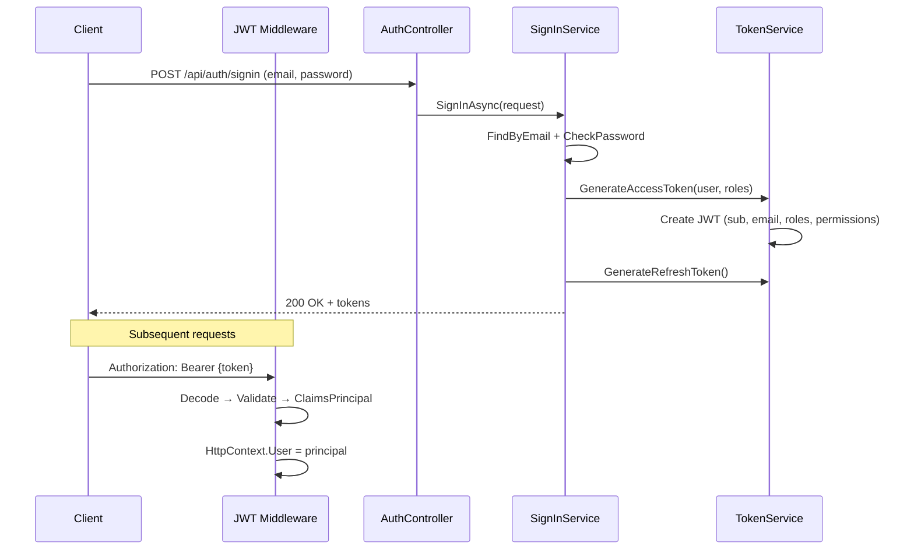
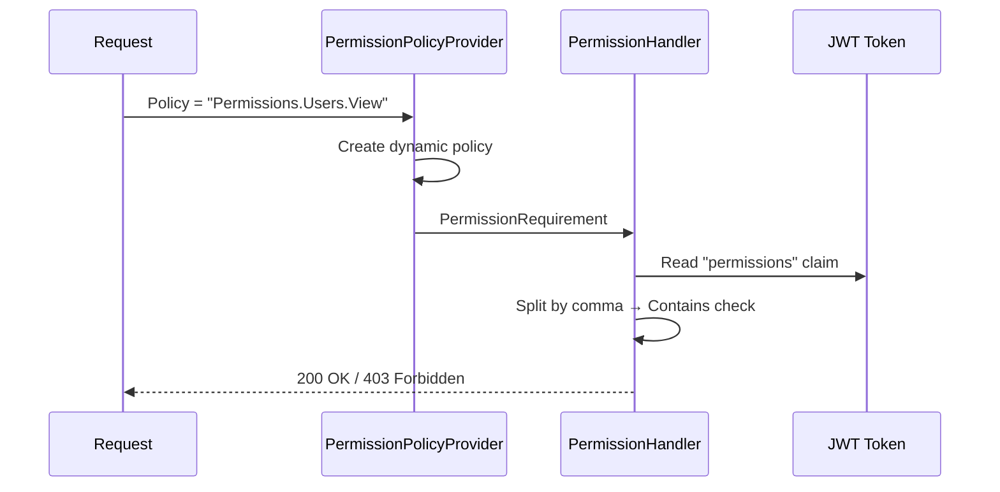
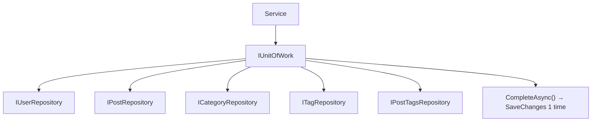
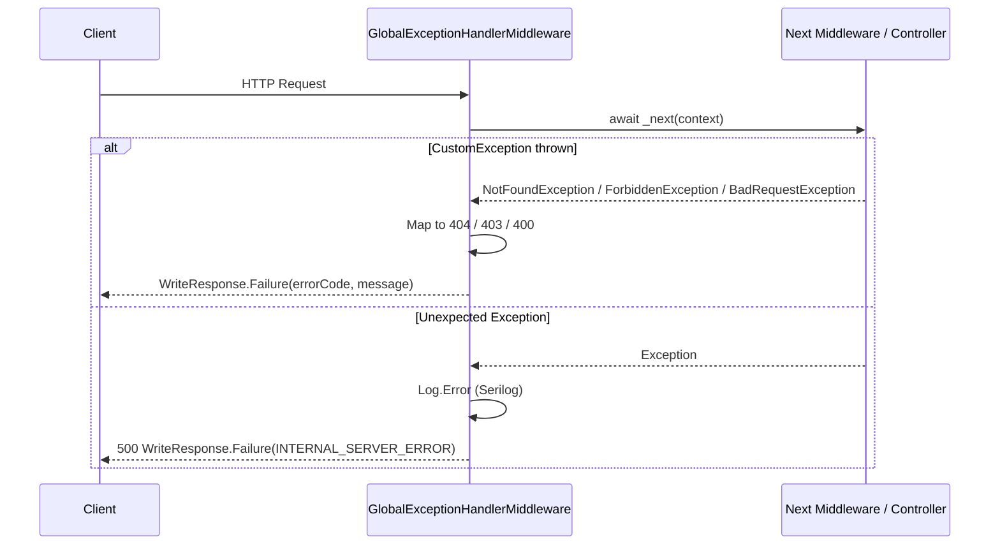
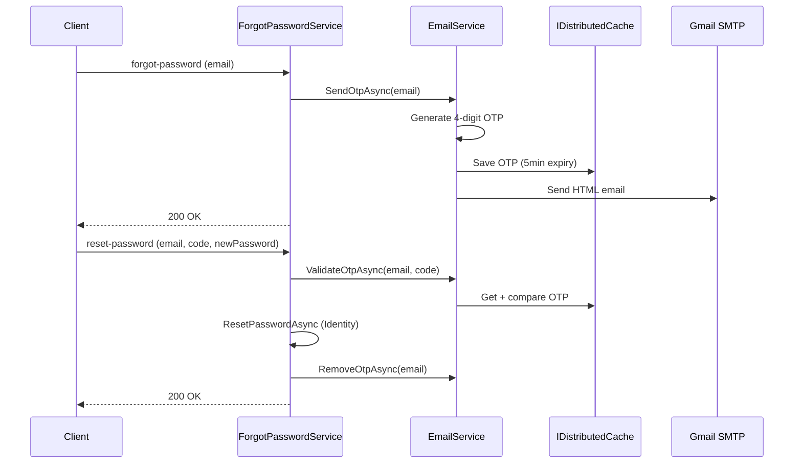

# CMS Project - Architecture

## Tech Stack

| Layer | Technology | Version |
|-------|-----------|---------|
| Frontend | React | TODO |
| Backend API | ASP.NET Core | .NET 10 |
| Database | PostgreSQL | Neon Cloud |
| ORM | Entity Framework Core | 10.0.9 |
| Authentication | JWT Bearer Token | - |
| Authorization | Permission-based (Dynamic Policies) | - |
| Caching | IDistributedCache | Redis-ready |
| Email | MailKit | 4.17.0 |
| Logging | Serilog | Console + File |
| Mapping | AutoMapper | 16.1.1 |
| Testing | xUnit + Moq | 2.9.3 / 4.20.72 |

---

## Architecture Overview



---

## Project Structure

```
backend/
├── src/
│   ├── Domain/                        → Entities, Enums, Constants
│   │   ├── Cores/Identity/            → User entity
│   │   ├── Cores/Content/             → Post, Category, Tag, PostTag
│   │   ├── Constants/                 → Roles, Permissions, UserClaims
│   │   └── Commons/                   → AuditableEntity base class
│   │
│   ├── Application/                   → Business Logic (no external dependencies)
│   │   ├── Services/
│   │   │   ├── Auth/                  → SignIn, SignUp, ForgotPassword
│   │   │   ├── User/                  → User CRUD + password/email/role
│   │   │   ├── Post/                  → Post CRUD
│   │   │   ├── Token/                 → ITokenService interface
│   │   │   ├── Otp/                   → IEmailService interface
│   │   │   └── Permission/            → Permission checking
│   │   ├── Contracts/                  → DTOs (Requests, Responses)
│   │   ├── Constants/                  → ErrorMessages, EmailTemplates
│   │   ├── Exceptions/                 → CustomException (NotFoundException, ForbiddenException, BadRequestException)
│   │   ├── Repositories/               → Repository interfaces
│   │   └── UnitOfWork/                 → IUnitOfWork interface
│   │
│   ├── Infrastructure/                 → External Concerns
│   │   ├── Repositories/               → EF Core implementations
│   │   ├── Services/                   → TokenService, EmailService
│   │   ├── UnitOfWork/                 → UnitOfWork implementation
│   │   └── Migrations/                 → EF Core migrations
│   │
│   └── WebApi/                         → Entry Point
│       ├── Controllers/                → Auth, User, AdminPost
│       ├── Authorization/              → Permission system
│       ├── Middlewares/                → GlobalExceptionHandlerMiddleware
│       └── Extensions/                 → DI, Auth, Serilog, Middleware
│
├── test/
│   ├── Application.Tests/              → service tests
│   ├── Infrastructure.Test/            → token + email tests
│   └── Test.Shared/                    → MockUserManager
│
└── docs/                                → Documentation
```

---

## Dependency Direction (Clean Architecture)



---

## Authentication Flow



---

## Authorization Levels

| Level | Mechanism | Example |
|-------|-----------|---------|
| Authenticated | `[Authorize]` | ChangeMyPassword |
| Role-based | `[Authorize(Roles="Admin")]` | Available (not used) |
| Permission-based | `[HasPermission(...)]` | Users.View, Posts.Create |

### Permission Flow



---

## Response Pattern

```csharp
// Write (no data)
WriteResponse.Success()
WriteResponse.Failure(errorCode, errorMessage?)

// Read (with data)
ReadResponse<T>.Success(data)
ReadResponse<T>.Failure(errorCode)

// Auth-specific
SignInResponse.Success(token, refreshToken)
SignUpResponse.Success()
```

---

## Unit of Work Pattern



---

## Exception Handling

All unhandled exceptions are caught centrally by `GlobalExceptionHandlerMiddleware` (registered as the **first** middleware in the pipeline).

### Custom Exception Hierarchy

```
CustomException  (abstract, Application.Exceptions)
├── NotFoundException   → 404 Not Found
├── ForbiddenException  → 403 Forbidden
└── BadRequestException → 400 Bad Request
```

Each subclass carries:
- `ErrorCode` — machine-readable constant (same format as `ErrorMessages`)
- `Message` — human-readable description (defaults to `ErrorCode` if omitted)

### Middleware Flow



### When to throw vs. return Failure

| Scenario | Approach |
|----------|---------|
| Service method returns result to caller (most cases) | Return `WriteResponse.Failure(errorCode)` |
| Deep helper / private method that cannot return a result | Throw `CustomException` subclass |
| Truly unexpected runtime error | Let it bubble — middleware catches it |

---

## OTP Email Flow

